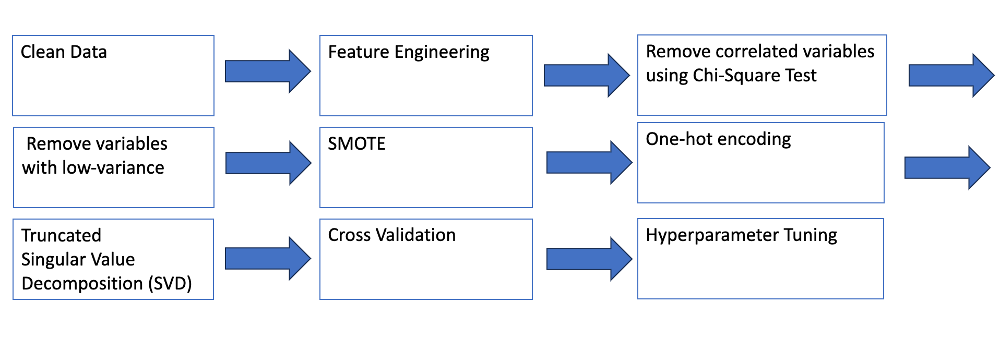
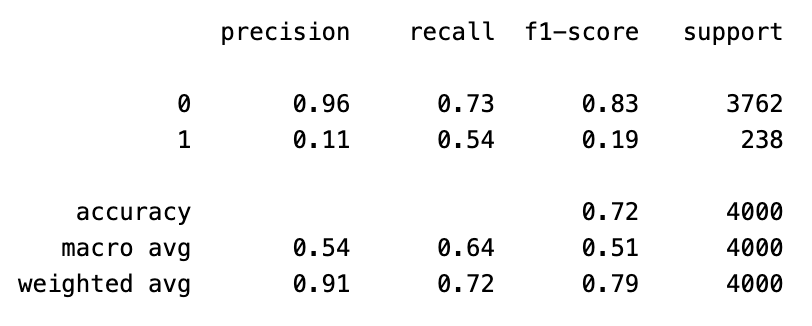
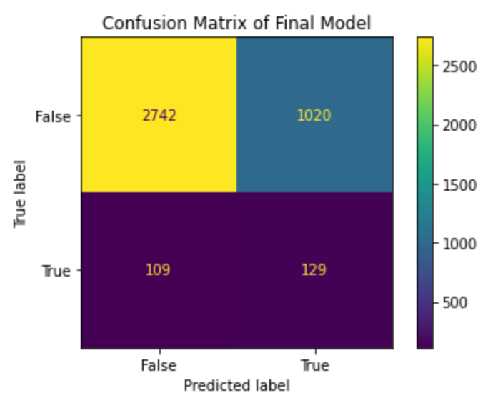

# Caravan-Insurance-Prediction
Forecasted purchase of caravan insurance using Random Forest Classifier

## Overview

Our goal was to build a machine learning model that can accurately and reliably predict whether
someone in a given postal code will purchase caravan insurance. Such a model could be used to 
market to members most likely to purchase insurance.

## Methodology

The table below summarizes the machine learning workflow. After cleaning data and adding new features,
such as number of policies purchased, correlated variables and low-variance variables were removed. Then, data
was truncated using Singular Value Decomposition (SVD) for computational efficiency and improved performance. 
Lastly, cross validation with 5 folds was applied to the following models : Logistic Regression, Random
Forest Classifier, ADA Boost, and XG Boost. Random Forest showed the best results with a weighted f1-score of 0.11.

## Results

Achieved F1-Score of 0.19 on test data, with a modest recall at 0.54 but a low preciion of 0.11.
This model is not yet ready for real-world application, but taught us how to optimally transform data 
as well as train and compare machine learning models. 

